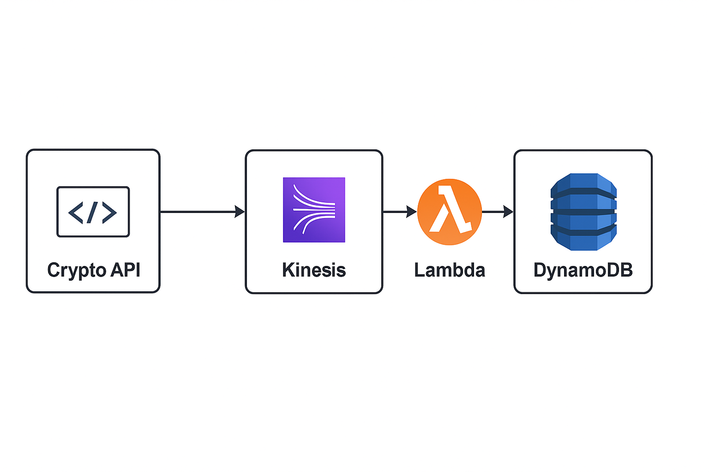

# 🚀 Real-Time Crypto Data Pipeline on AWS

A real-time, fully serverless cryptocurrency data streaming and analytics pipeline built using Amazon Web Services.

## 🔥 Features
- Live crypto price ingestion
- Real-time data streaming using AWS Kinesis
- Serverless processing with AWS Lambda
- Data storage using DynamoDB
- Real-time analytics with Amazon QuickSight
- Price alerts using Amazon SNS

## 🧱 Architecture

## 🛠 Tech Stack
- AWS Kinesis
- AWS Lambda
- DynamoDB
- Amazon SNS
- Amazon QuickSight
- Python

## 📊 Data Flow
1. Crypto API → Kinesis Data Stream  
2. Kinesis → Lambda  
3. Lambda → DynamoDB  
4. DynamoDB → QuickSight  
5. Price Alerts → SNS → Email

## 🚀 How to Run
1. Deploy AWS services
2. Configure Kinesis stream
3. Deploy Lambda functions
4. Connect DynamoDB
5. Setup QuickSight Dashboard
6. Configure SNS alerts

## 💼 Use Cases
- Crypto trading platforms
- Financial analytics systems
- Algorithmic trading pipelines
